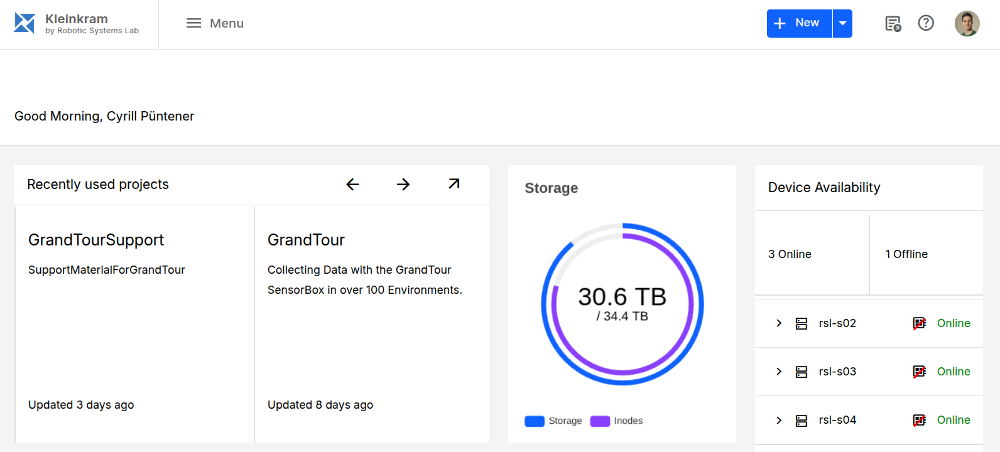

# Kleinkram - Open Robotic Data Management

Kleinkram is a self-hosted, open-source platform for managing and processing robotics data. It provides a structured way to store, organize, and act on your data.

- **Organize**: Structure data in Projects and Missions.
- **Store**: Support for ROS bags (`.bag`, `.mcap`), ZED camera recordings (`.svo2`), and configs (`.yml`).
- **Process**: Run automated actions (validation, conversion, extraction) using Kleinkram Actions.
- **Collaborate**: Share data with granular access control.

## Documentation

For full documentation, please visit [docs.datasets.leggedrobotics.com](https://docs.datasets.leggedrobotics.com/).

## Try Kleinkram Locally

You can easily run a local instance of Kleinkram to try it out. This has been tested on Ubuntu 24.04 and macOS.

1. **Clone the repository**

```bash
git clone git@github.com:leggedrobotics/kleinkram.git
cd kleinkram
```

2. **Start the application**

```bash
docker compose up --build
```

<details>
<summary>Why <code>--build</code>?</summary>
The <code>--build</code> flag ensures that the Docker images are built before starting. For more details on Docker Compose, see the <a href="https://docs.docker.com/compose/">official docs</a>.
</details>

> [!WARNING]
> If you have run Kleinkram locally before, you should consider deleting all existing data. See the <a href="https://docs.datasets.leggedrobotics.com/development/try-locally">Try Kleinkram Locally</a> documentation for more details.

> [!TIP]
> **Troubleshooting missing modules / API not reachable on localhost:3000**
> If logs contain `Cannot find module ...`, recreate app `node_modules` volumes and rebuild:
> ```bash
> docker compose rm -sf api-server queue-consumer frontend docs \
> && docker volume rm kleinkram_backend_node_modules kleinkram_frontend_node_modules kleinkram_queue_consumer_node_modules kleinkram_node_modules \
> && docker compose up -d --build api-server queue-consumer frontend docs
> ```

3. **Access the application**

You can now access the frontend at `http://localhost:8003`.

> [!TIP]
> **Browser Compatibility**
> Make sure to use Chrome or Firefox for the best experience with the local development server. There are some known issues related to Safari when running Kleinkram locally.

4. **Configure CLI (Optional)**

If you want to use the CLI with your local instance, you need to set the endpoint to local:

```bash
klein endpoint local
klein login
```

<details>
<summary>Start Developing</summary>
For a deeper dive into the project structure and development workflow, see the <a href="https://docs.datasets.leggedrobotics.com/development/application-structure">Application Structure</a> documentation. Your development environment is designed for Ubuntu 24.04.
</details>

## Community Guidelines

### Contributing

We welcome contributions! Please see our [Contributing Guide](https://docs.datasets.leggedrobotics.com/development/contributing) for details on how to get started, including our branching strategy and pull request workflow.

> [!TIP]
> In short: Fork the repository, create a feature branch from `dev`, and open a pull request targeting the upstream `dev` branch when ready. We will review the changes and merge them into `dev` if they are good.

### Reporting Issues

Found a bug or have a feature request? Please [open an issue on GitHub](https://github.com/leggedrobotics/kleinkram/issues).

### Seeking Support

For help and support:

1. Check the [official documentation](https://docs.datasets.leggedrobotics.com/).
2. If you can't find an answer, [open an issue on GitHub](https://github.com/leggedrobotics/kleinkram/issues).
