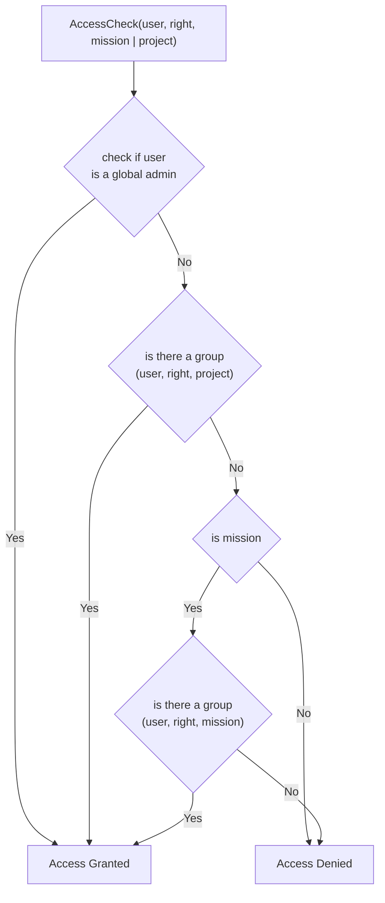

# Access Control - Basic Concepts

This page describes the basic concepts of the access control in the application.

## Principle of Group Based Access Control

The access control is based on groups. Each user can be a member of multiple groups. Each group is assigned a single
`AccessGroupRights`. The `AccessGroupRights` defines the rights of the group.

| AccessGroupRights | Value |
|-------------------|-------|
| READ              | 0     |
| CREATE            | 10    |
| WRITE             | 20    |
| DELETE            | 30    |

### Primary Group

Each user is member of at least one group, their primary group. This group is unique to each user and is created when
the user is created. Only the user itself is member of this group. No other user can be member of this group.

### Affiliation Groups

Affiliation groups are groups to which user are added automatically based on their mail domain.
These default groups can be configured in the configuration file: `backend/access_config.json`.

#### Example

```json
{
  "emails": [
    {
      "email": "leggedrobotics.com",
      "access_groups": [
        "00000000-0000-0000-0000-000000000000"
      ]
    }
  ],
  "access_groups": [
    {
      "name": "Leggedrobotics",
      "uuid": "00000000-0000-0000-0000-000000000000",
      // read only
      "rights": 0
    }
  ]
}
```

## How Access is Checked?

Below is the default check for access rights. For the case of authentication using Api Keys, as used in actions, a
different flow is used.


