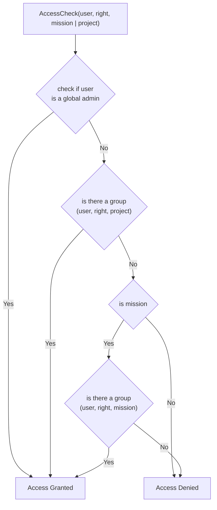

# Access Control - Basic Concepts

This page describes the basic concepts of the access control in the application.

## Principle of Group Based Access Control

The access control is based on groups. Each user can be a member of multiple groups. Each group is assigned a single
`AccessGroupRights`. The `AccessGroupRights` defines the rights of the group.

| AccessGroupRights | Value |
| ----------------- | ----- |
| READ              | 0     |
| CREATE            | 10    |
| WRITE             | 20    |
| DELETE            | 30    |

### Primary Group

Each user is member of at least one group, their primary group. This group is unique to each user and is created when
the user is created. Only the user itself is member of this group. No other user can be member of this group.

### Affiliation Groups

Affiliation groups are groups to which user are added automatically based on their mail domain.
These groups are configured per deployment in an `access_config.json`; it is not part of the Docker image.
The backend reads it from `ACCESS_CONFIG_PATH` and refuses to start if it is missing or invalid.
The deployment compose files mount the file from `ACCESS_CONFIG_FILE` (default: `./access_config.json` next to the
compose file). Local development and tests use `backend/access_config.dev.json`.

A user matches an entry if their email ends with `@<email>`; subdomains do not match. On every start, the backend
syncs the affiliation groups and memberships of all users with the config: missing groups and memberships are
created, groups are renamed, and groups and memberships no longer covered by the config are removed. Each change is
logged by `AffiliationGroupService`.

#### Example

```json
{
    "emails": [
        {
            "email": "kleinkram.dev",
            "access_groups": ["00000000-0000-0000-0000-000000000000"]
        }
    ],
    "access_groups": [
        {
            "name": "Kleinkram Developers",
            "uuid": "00000000-0000-0000-0000-000000000000",
            "rights": 10
        }
    ]
}
```

## How Access is Checked?

Below is the default check for access rights. For the case of authentication using Api Keys, as used in actions, a
different flow is used.


```mermaid
graph TD
    A["AccessCheck(user, right, mission | project)"] --> B{"check if user\nis a global admin"}
    B -->|Yes| C[Access Granted]
    B -->|No| E{"is there a group\n(user, right, project)"}
    E -->|Yes| C[Access Granted]
    E -->|No| G{"is mission"}
    G -->|No| F[Access Denied]
    G -->|Yes| H{"is there a group\n(user, right, mission)"}
    H -->|Yes| C[Access Granted]
    H -->|No| F
```
