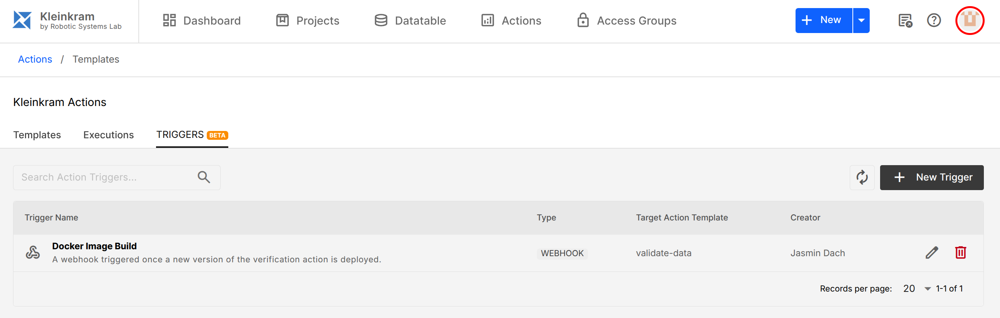

# Action Triggers

Action triggers allow you to automate the execution of your actions based on specific events or schedules.



Kleinkram supports three types of triggers:

| Trigger Type          | Description    | Example Use Case                                                          |
| --------------------- | -------------- | ------------------------------------------------------------------------- |
| Cron Triggers         | Schedule-based | Generate a report with summary statistics daily at midnight.              |
| Webhook Triggers      | Event-based    | Run a verification action as soon as a new docker image version is pushed |
| File Pattern Triggers | Data-based     | Run a post-processing action as soon as a new file is uploaded            |

## Cron Triggers

Cron triggers allow you to schedule actions to run periodically at fixed times or intervals. This is useful for regular maintenance tasks, nightly reports, or periodic data synchronization.

To set up a cron trigger:

1. Go to the **Triggers** tab.
2. Click **Add Trigger** and select **Cron**.
3. Enter a valid cron expression (e.g., `0 0 * * *` for daily at midnight).

::: tip Cron Syntax
Kleinkram uses standard cron syntax. You can use sites like [crontab.guru](https://crontab.guru/) to help generate expressions.
:::

## Webhook Triggers

Webhook triggers allow external systems to trigger Kleinkram actions via HTTP requests. This enables integration with CI/CD pipelines, external data sources, or other tools in your ecosystem.

To set up a webhook trigger:

1. Go to the **Triggers** tab.
2. Click **Add Trigger** and select **Webhook**.
3. Kleinkram will generate a unique **Webhook URL** for this trigger.
4. You can now send a `POST` request to this URL to trigger the action.

### Payload

You can pass data to the action by including a JSON body in your POST request. This data will be available to the action environment.

```bash
curl -X POST https://your-kleinkram-instance.com/api/v1/hooks/trigger/YOUR_WEBHOOK_ID
```

## File Pattern Triggers

File pattern triggers allow you to automatically run an action when a file matching a specific pattern is uploaded or modified within a mission. This is perfect for processing pipelines, such as automatically converting new bag files or analyzing newly uploaded images.

To set up a file pattern trigger:

1. Go to the **Triggers** tab.
2. Click **Add Trigger** and select **File Pattern**.
3. Enter a **glob pattern** to match files (e.g., `2026-*-*_mission-*.mcap`).
4. The action will now trigger automatically whenever a matching file is uploaded to any mission the action has access to.

::: tip
You can use `*` to match any character sequence in a file name.
:::
