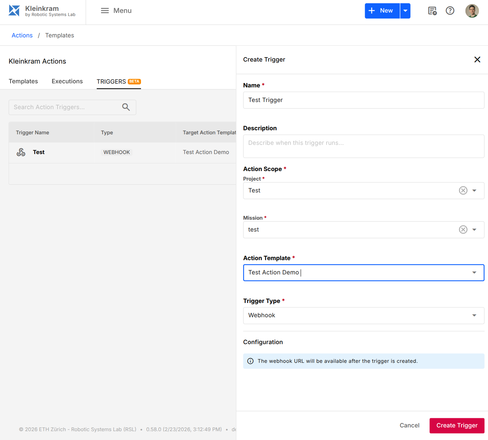

# Action Triggers

Action triggers allow you to automate the execution of your actions based on specific events or schedules.



Kleinkram supports three types of triggers:

| Trigger Type          | Description    | Example Use Case                                                          |
| --------------------- | -------------- | ------------------------------------------------------------------------- |
| Cron Triggers         | Schedule-based | Generate a report with summary statistics daily at midnight.              |
| Webhook Triggers      | Event-based    | Run a verification action as soon as a new docker image version is pushed |
| File Pattern Triggers | Data-based     | Run a post-processing action as soon as a new file is uploaded            |

## Cron Triggers

Cron triggers allow you to schedule actions to run periodically at fixed times or intervals. This is useful for regular maintenance tasks, nightly reports, or periodic data synchronization.

To set up a cron trigger:

1. From your action's settings, go to the **Triggers** tab.
2. Click **New Trigger** and select **Cron** for the Trigger Type.
3. Enter a valid cron expression (e.g., `0 0 * * *` for daily at midnight).
4. Click **Create Trigger**.

The action will now run automatically based on the scheduled cron expression.

::: tip Cron Syntax
Kleinkram uses standard cron syntax. You can use sites like [crontab.guru](https://crontab.guru/) to help generate expressions.
:::

## Webhook Triggers

Webhook triggers allow external systems to trigger Kleinkram actions via HTTP requests. This enables integration with CI/CD pipelines, external data sources, or other tools in your ecosystem.

To set up a webhook trigger:

1. From your action's settings, go to the **Triggers** tab.
2. Click **New Trigger** and select **Webhook** for the Trigger Type.
3. Click **Create Trigger**.

Kleinkram will generate a unique **Webhook URL** for this trigger. You can now send a `POST` request to this URL to trigger the action.

### Triggering the Webhook

Send a POST request to the webhook URL to trigger the action.

```bash
curl -X POST https://your-kleinkram-instance.com/api/v1/hooks/trigger/YOUR_WEBHOOK_ID
```

## File Pattern Triggers

File pattern triggers allow you to automatically run an action when a file matching a specific pattern is uploaded or modified within a mission. This is perfect for processing pipelines, such as automatically converting new bag files or analyzing newly uploaded images.

To set up a file pattern trigger:

1. From your action's settings, go to the **Triggers** tab.
2. Click **New Trigger** and select **File Pattern** for the Trigger Type.
3. Enter a **glob pattern** to match files.
4. Click **Create Trigger**.

The action will now trigger automatically whenever a matching file is uploaded to any mission the action has access to.

### Glob Pattern Examples

Kleinkram flattens all uploaded files, meaning **filenames do not contain folders or slashes**. Therefore, your glob patterns should only match against the filename itself.

| Pattern             | Description                                                                                            |
| ------------------- | ------------------------------------------------------------------------------------------------------ |
| `*.bag`             | Matches any `.bag` file.                                                                               |
| `2026-*.yaml`       | Matches any `.yaml` file starting with `2026-`.                                                        |
| `*_processed.db3`   | Matches any `.db3` file ending in `_processed`.                                                        |
| `mission-10-?.mcap` | Matches files like `mission-10-A.mcap` or `mission-10-1.mcap` using the `?` single-character wildcard. |

::: tip
You can use `*` to match any character sequence and `?` to match a single character.
:::
