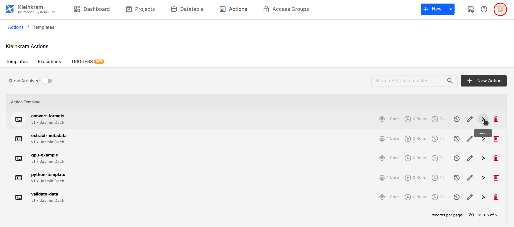
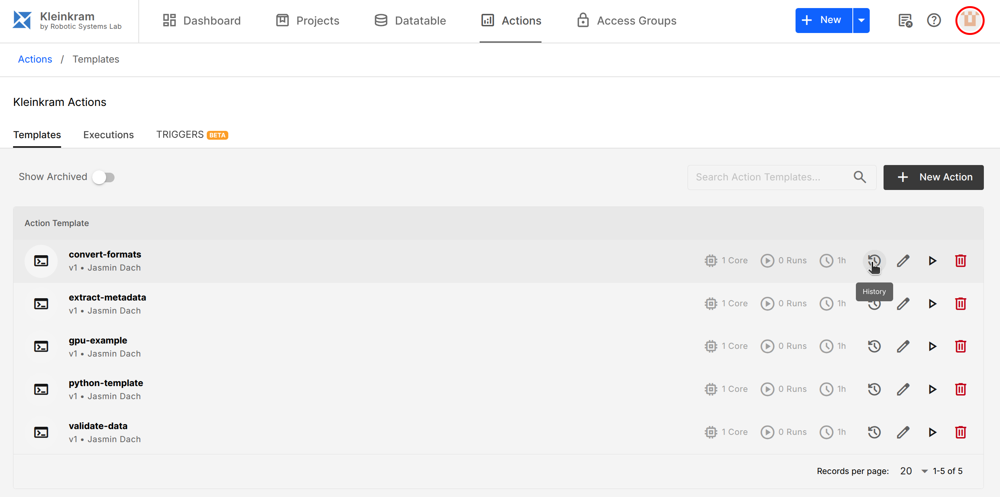
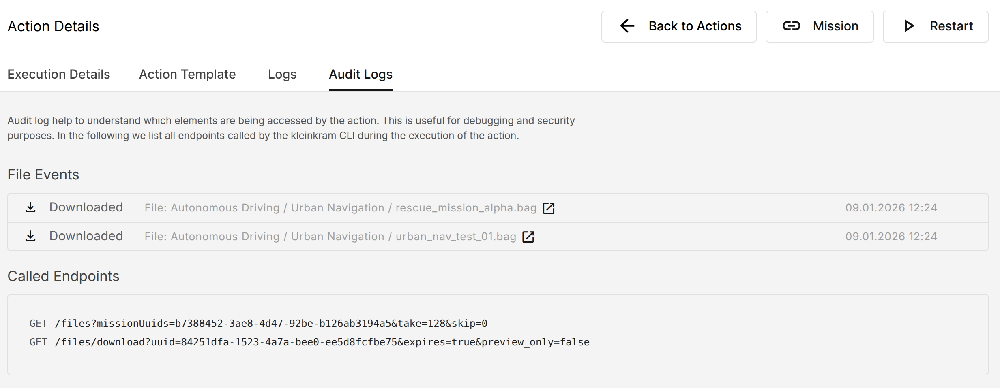

# Use Kleinkram Actions

Kleinkram Actions are powerful tools that allow you to process, verify, and analyze your data directly within your
Kleinkram instance using hosted action runners. Kleinkram Actions can automate tasks such as data validation, format
conversion, and metadata extraction.

::: tip Core Concepts of Kleinkram Actions

- **Action Template**: This is the _definition_ or _blueprint_ of an action. It includes the Docker image to run, the
  default command, resource limits (CPU/Memory), and access rights. You create a template once and can reuse it many
  times. [-> Learn more](use-actions#action-templates).
- **Action Execution**: This is a specific _instance_ of an action running on a specific mission scope. When you
  click the "Play" button on a template, you create an execution. Each execution has its own logs, status, and output
  artifacts. [-> Learn more](use-actions#action-execution).
- **Action Trigger**: Action triggers allow you to automate the execution of your actions based on specific events or schedules. [-> Learn more](triggers.md).

:::

## Launch Actions via Web Interface

Actions can be configured and launched directly within the Kleinkram web interface. For that you must navigate to the
"Actions" page in the main menu.

In the "Templates" tab, you will see a list of available [Action Templates](#action-templates). To launch an
action simply click on the play icon, which opens a side panel where you can select the scope of the action execution
and confirm the launch.

Actions are executed within the context of a specific mission or project. The action will have access to all files
within that mission. For your convenience, you can also access files of other missions within the same project.

Actions are queued and executed on hosted action runners within your Kleinkram instance. You can monitor the progress of
your actions in the "Executions" tab.

## Action Templates

Action Templates define the behavior of an action, including the Docker image to use, resource limits, and default
entrypoint/command. You can create your own custom action templates or use the provided example actions.

::: tip How to Create Custom Action Templates
Please refer to the [Writing Custom Actions](write-actions.md) guide for detailed instructions on creating your own
action templates. By default, Kleinkram comes with several pre-defined action templates that you can use
out of the box to try out the functionality of the Kleinkram Actions system.
:::

### Version Control for Action Templates

Action Templates are version-controlled. When you create or modify an action template, a new version is created. This
allows you to track changes over time and revert to previous versions if needed. Each execution of an action is tied to
a specific version of the template, ensuring consistency and reproducibility.

::: tip
We recommend using version tags while specifying Docker images in your action templates. This ensures that your actions
are always reproducible and not affected by changes in the `latest` image. E.g., use `python:3.9-slim` instead of
`python:latest`.
:::

Versions of an action template can be viewed by clicking on the version icon next to the action name in the action
template list:

### Automating Actions using Action Triggers

You can automate action execution using Triggers. Triggers can schedule actions (Cron), run them on external events (Webhook), or react to file uploads (File Pattern). Learn more in the [Action Triggers](triggers.md) guide.

## Action Execution

Actions are executed as isolated docker containers on hosted action runners. When you launch an action, the following
steps occur behind the scenes:

1. The action is queued for execution.
2. When a runner is available, the action starts executing. During execution:
    - The specified Docker image is pulled (if not already cached on the runner).
    - The action's container is started with the defined resource limits (CPU, Memory).
    - The action's entrypoint/command is executed.
3. Any output files placed in `/out` are saved as artifacts.
4. The action's status is updated based on the exit code of the
   container ([-> Action Exit Codes](/usage/actions/write-actions#action-status-exit-codes)).
5. Logs and artifacts are made available for download.

### Artifacts and Output Files

Actions can generate output files, such as reports, converted data, or logs. These files are stored as "Artifacts" and
can be downloaded from the action execution page.

::: tip Artifact Retention Policy
Artifacts are kept for 3 months before being automatically deleted.
:::

### Audit Logs

All action executions generate detailed audit logs that capture every file operation performed during the action's
lifecycle, including file uploads, and downloads. Audit logs provide transparency and help with debugging.

